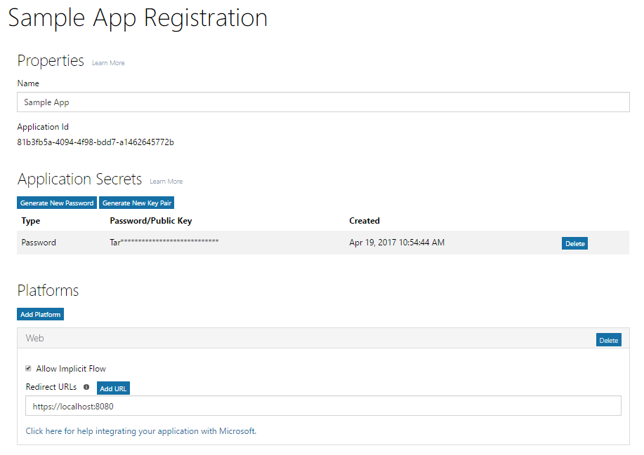
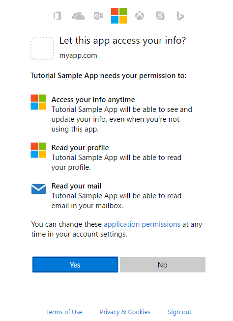

# ASP.NET MVC Application calling Microsoft Graph as User

1. [Register your application](#register_your_application)
2. [Get authorization](#get_authorization)
3. [Get a token](#get_a_token)
4. [Use the access token to call Microsoft Graph](#use_the_access_token_to_call_microsoft_graph)
5. [Use the refresh token to get a new access token](#use_the_refresh_token_to_get_a_new_access_token)

## 1. Register your application

Your app must be registered with Azure AD. Registering your app establishes a unique application ID and other values that your app uses to authenticate with Azure AD and get tokens. For the Azure AD v2.0 endpoint, you register your app with the [Microsoft App Registration Portal](https://apps.dev.microsoft.com). You can use either a Microsoft account or a work or school account to register your app. Depending on the type of app you are developing, you will need to copy one or more properties during registration to use when you configure authentication and authorization for your app. 


The following screenshot shows an example web app registration that has been configured with a password and implicit flow. 


To register your app, follow these steps; be sure to copy the indicated values to use when configuring authorization for your app:

1. Sign into the [Microsoft App Registration Portal](https://apps.dev.microsoft.com/).
   
    You can sign in with either a Microsoft account or a work or school account. 

2. Choose **Add an app**.
    > Note: If you signed in with a work or school account, select the **Add an app** button for **Converged applications**. 

3. Enter a name for the app and choose **Create application**.

	The registration page displays, listing the properties of your app.

4. Copy the application ID. This is the unique identifier for your app.

	You'll use the application ID to configure the app.

5. Under **Platforms**, choose **Add Platform**, and select the appropriate platform for your app:
	
	**For native or mobile apps**:

	1. Select **Native Application**.

	2. Copy the **Built-in redirect URI** value. You'll need this to configure your app.

		The redirect URI is a unique URI provided for your application to ensure that messages sent to that URI are only sent to that application. 

	**For web apps**:

	1. Select **Web**.

	2. Depending on the type of authentication flow you're using, you may have to make sure the **Allow Implicit Flow** check box is selected. 
		
		The **Allow Implicit Flow** option enables the OpenID Connect hybrid and implicit flows. The hybrid flow enables the app to receive both sign-in info (the id token) and artifacts (in this case, an authorization code) that the app uses to obtain an access token. The hybrid flow is the default flow used by the OWIN OpenID Connect middleware. For single page apps (SPA), the implicit flow enables the app to receive sign-in info and the access token. 

	3. Specify a Redirect URL.
		
		The redirect URL is the location in your app that the Azure AD v2.0 endpoint calls when it has processed the authentication request.

	4. Under **Application Secrets**, choose **Generate New Password**. Copy the app secret from the **New password generated** dialog box.
		> **Important** You must copy the app secret before you close the **New password generated** dialog. After you close the dialog, you cannot retrieve the secret. 
			
6. Choose **Save**.

Apps that provide an administrator consent experience may need an additional Redirect URL for Azure AD to return the response to.

For more detail about the App Registration Portal and the properties you can configure for your App, see [App registration reference](https://docs.microsoft.com/en-us/azure/active-directory/develop/active-directory-v2-registration-portal).  

## 2. Get authorization
The first step to getting an access token for many OpenID Connect and OAuth 2.0 flows is to redirect the user to the Azure AD v2.0 `/authorize` endpoint. Azure AD will sign the user in and ensure their consent for the permissions your app requests. In the authorization code grant flow, after consent is obtained, Azure AD will return an authorization_code to your app that it can redeem at the Azure AD v2.0 `/token` endpoint for an access token.

### Authorization request 
The following shows an example request to the `/authorize` endpoint. 

With the Azure AD v2.0 endpoint, permissions are requested using the `scope` parameter. In this example, the Microsoft Graph permissions requested are for _User.Read_ and _Mail.Read_, which will allow the app to read the profile and mail of the signed-in user. The _offline\_access_ permission is requested so that the app can get a refresh token, which it can use to get a new access token when the current one expires. 

```
// Line breaks for legibility only

https://login.microsoftonline.com/{tenant}/oauth2/v2.0/authorize?
client_id=6731de76-14a6-49ae-97bc-6eba6914391e
&response_type=code
&redirect_uri=http%3A%2F%2Flocalhost%2Fmyapp%2F
&response_mode=query
&scope=offline_access%20user.read%20mail.read
&state=12345
```
| Parameter |  | Description |
| --- | --- | --- |
| tenant |required |The `{tenant}` value in the path of the request can be used to control who can sign into the application.  The allowed values are `common` for both Microsoft accounts and work or school accounts, `organizations` for work or school accounts only, `consumers` for Microsoft accounts only, and tenant identifiers such as the tenant ID or domain name.  For more detail, see [protocol basics](https://docs.microsoft.com/azure/active-directory/develop/active-directory-v2-protocols#endpoints). |
| client_id |required |The Application ID that the registration portal ([apps.dev.microsoft.com](https://apps.dev.microsoft.com/?referrer=https://azure.microsoft.com/documentation/articles&deeplink=/appList)) assigned your app. |
| response_type |required |Must include `code` for the authorization code flow. |
| redirect_uri |recommended |The redirect_uri of your app, where authentication responses can be sent and received by your app.  It must exactly match one of the redirect_uris you registered in the app registration portal, except it must be URL encoded.  For native and mobile apps, you should use the default value of `https://login.microsoftonline.com/common/oauth2/nativeclient`. |
| scope |required |A space-separated list of the Microsoft Graph permissions that you want the user to consent to. This may also include OpenID scopes. |
| response_mode |recommended |Specifies the method that should be used to send the resulting token back to your app.  Can be `query` or `form_post`. |
| state |recommended |A value included in the request that will also be returned in the token response.  It can be a string of any content that you wish.  A randomly generated unique value is typically used for [preventing cross-site request forgery attacks](http://tools.ietf.org/html/rfc6749#section-10.12).  The state is also used to encode information about the user's state in the app before the authentication request occurred, such as the page or view they were on. |

> **Important**: Microsoft Graph exposes two kinds of permissions: application and delegated. For apps that run with a signed-in user, you request delegated permissions in the `scope` parameter. These permissions delegate the privileges of the signed-in user to your app, allowing it to act as the signed-in user when making calls to Microsoft Graph. For more detailed information about the permissions available through Microsoft Graph, see the [Permissions reference](./permissions_reference.md).
 
### Consent experience

At this point, the user will be asked to enter their credentials to authenticate with Azure AD. The v2.0 endpoint will also ensure that the user has consented to the permissions indicated in the `scope` query parameter.  If the user has not consented to any of those permissions and if an administrator has not previously consented on behalf of all users in the organization, Azure AD will ask the user to consent to the required permissions.  

Here is an example of the consent dialog presented for a Microsoft account:



> **Try** If you have a Microsoft account or an Azure AD work or school account, you can try this for yourself by clicking on the link below. After signing in, your browser should be redirected to `https://localhost/myapp/` with a `code` in the address bar.
> 
> <a href="https://login.microsoftonline.com/common/oauth2/v2.0/authorize?client_id=6731de76-14a6-49ae-97bc-6eba6914391e&response_type=code&redirect_uri=http%3A%2F%2Flocalhost%2Fmyapp%2F&response_mode=query&scope=offline_access%20user.read%20mail.read&state=12345" target="_blank">https://login.microsoftonline.com/common/oauth2/v2.0/authorize...</a>

### Authorization response
If the user consents to the permissions your app requested, the response will contain the authorization code in the `code` parameter. Here is an example of a successful response to the request above. Because the `response_mode` parameter in the request was set to `query`, the response is returned in the query string of the redirect URL.

```
GET http://localhost/myapp/?
code=M0ab92efe-b6fd-df08-87dc-2c6500a7f84d
&state=12345
```
| Parameter | Description |
| --- | --- |
| code |The authorization_code that the app requested. The app can use the authorization code to request an access token for the target resource.  Authorization_codes are very short lived, typically they expire after about 10 minutes. |
| state |If a state parameter is included in the request, the same value should appear in the response. The app should verify that the state values in the request and response are identical. |

### Code sample
In ASP.NET MVC, authorization is usually handled in middleware. The following is an example of the using middleware in the OWIN Startup of an ASP.NET MVC Application.

```
public void ConfigureAuth(IAppBuilder app)
{
    // Application settings
    var graphScopes = "user.read mail.read";
    var applicationId = "6731de76-14a6-49ae-97bc-6eba6914391e";
    var redirectUri = "http://localhost/myapp";
    var applicationSecret = "JqQX2PNo9bpM0uEihUPzyrh";

    app.SetDefaultSignInAsAuthenticationType(CookieAuthenticationDefaults.AuthenticationType);
    app.UseCookieAuthentication(new CookieAuthenticationOptions());
    app.UseOpenIdConnectAuthentication(
        new OpenIdConnectAuthenticationOptions
        {                
            ClientId = applicationId,
            Authority = "https://login.microsoftonline.com/common/v2.0",
            PostLogoutRedirectUri = redirectUri,
            RedirectUri = redirectUri,
            Scope = "openid email profile offline_access " + graphScopes,
            TokenValidationParameters = new TokenValidationParameters
            {
                ValidateIssuer = false
            },
            Notifications = new OpenIdConnectAuthenticationNotifications
            {
                AuthorizationCodeReceived = async (context) =>
                {
                    // TODO: handle authorization code received
                },
                AuthenticationFailed = (context) =>
                {
                    // TODO: handle authentication failed
                }
            }
        });
}
```

The Microsoft Authentication Library contains logic to get the authorization url, which can be used to manually redirect the user for authorization. The following code shows how to do this in C#.

```
ConfidentialClientApplication client = new ConfidentialClientApplication(applicationId, redirectUri, new ClientCredential(applicationSecret), userTokenCache, null);
var uri = await client.GetAuthorizationRequestUrlAsync(graphScopes, null, null);
```

## 3. Get a token
Your app uses the authorization `code` received in the previous step to request an access token by sending a `POST` request to the `/token` endpoint.

### Token request
```
// Line breaks for legibility only

POST /common/oauth2/v2.0/token HTTP/1.1
Host: https://login.microsoftonline.com
Content-Type: application/x-www-form-urlencoded

client_id=6731de76-14a6-49ae-97bc-6eba6914391e
&scope=user.read%20mail.read
&code=OAAABAAAAiL9Kn2Z27UubvWFPbm0gLWQJVzCTE9UkP3pSx1aXxUjq3n8b2JRLk4OxVXr...
&redirect_uri=http%3A%2F%2Flocalhost%2Fmyapp%2F
&grant_type=authorization_code
&client_secret=JqQX2PNo9bpM0uEihUPzyrh    // NOTE: Only required for web apps
```

| Parameter |  | Description |
| --- | --- | --- |
| tenant |required |The `{tenant}` value in the path of the request can be used to control who can sign into the application.  The allowed values are `common` for both Microsoft accounts and work or school accounts, `organizations` for work or school accounts only, `consumers` for Microsoft accounts only, and tenant identifiers such as the tenant ID or domain name.  For more detail, see [protocol basics](https://docs.microsoft.com/azure/active-directory/develop/active-directory-v2-protocols#endpoints). |
| client_id |required |The Application ID that the registration portal ([apps.dev.microsoft.com](https://apps.dev.microsoft.com/?referrer=https://azure.microsoft.com/documentation/articles&deeplink=/appList)) assigned your app. |
| grant_type |required |Must be `authorization_code` for the authorization code flow. |
| scope |required |A space-separated list of scopes.  The scopes requested in this leg must be equivalent to or a subset of the scopes requested in the first (authorization) leg.  If the scopes specified in this request span multiple resource servers, then the v2.0 endpoint will return a token for the resource specified in the first scope. |
| code |required |The authorization_code that you acquired in the first leg of the flow. |
| redirect_uri |required |The same redirect_uri value that was used to acquire the authorization_code. |
| client_secret |required for web apps |The application secret that you created in the app registration portal for your app.  It should not be used in a native app, because client_secrets cannot be reliably stored on devices.  It is required for web apps and web APIs, which have the ability to store the client_secret securely on the server side. |

### Token response
Although the access token is opaque to your app, the response contains a list of the permissions that the access token is good for in the `scope` parameter. 

```
{
    "token_type": "Bearer",
    "scope": "user.read%20Fmail.read",
    "expires_in": 3600,
    "access_token": "eyJ0eXAiOiJKV1QiLCJhbGciOiJSUzI1NiIsIng1dCI6Ik5HVEZ2ZEstZnl0aEV1Q...",
    "refresh_token": "AwABAAAAvPM1KaPlrEqdFSBzjqfTGAMxZGUTdM0t4B4..."
}
```
| Parameter | Description |
| --- | --- |
| token_type |Indicates the token type value. The only type that Azure AD supports is Bearer |
| scope |A space separated list of the Microsoft Graph permissions that the access_token is valid for. |
| expires_in |How long the access token is valid (in seconds). |
| access_token |The requested access token. Your app can use this token to call Microsoft Graph. |
| refresh_token |An OAuth 2.0 refresh token. Your app can use this token to acquire additional access tokens after the current access token expires.  Refresh tokens are long-lived, and can be used to retain access to resources for extended periods of time.  For more detail, refer to the [v2.0 token reference](https://docs.microsoft.com/azure/active-directory/develop/active-directory-v2-tokens). |

### Code sample
In ASP.NET MVC, getting a token from authorization code is usually handled in middleware via AuthorizationCodeReceived event. The following is an example of this.

```
Notifications = new OpenIdConnectAuthenticationNotifications
{
    AuthorizationCodeReceived = async (context) =>
    {
        var code = context.Code;
        string signedInUserID = context.AuthenticationTicket.Identity.FindFirst(ClaimTypes.NameIdentifier).Value;

        TokenCache userTokenCache = new SessionTokenCache(signedInUserID,context.OwinContext.Environment["System.Web.HttpContextBase"] as HttpContextBase).GetMsalCacheInstance();
        
        ConfidentialClientApplication client = new ConfidentialClientApplication(applicationId, redirectUri, new ClientCredential(applicationSecret), userTokenCache, null);
        string[] scopes = graphScopes.Split(new char[] { ' ' });

        AuthenticationResult result = await client.AcquireTokenByAuthorizationCodeAsync(code, scopes);
    },
    AuthenticationFailed = (context) =>
    {
        // TODO: handle authentication failed
    }
}
```

## 4. Use the access token to call Microsoft Graph

Once you have an access token, you can use it to call Microsoft Graph by including it in the `Authorization` header of a request. The following request gets the profile of the signed-in user.

```
GET https://graph.microsoft.com/v1.0/me 
Authorization: Bearer eyJ0eXAiO ... 0X2tnSQLEANnSPHY0gKcgw
Host: graph.microsoft.com

```
A successful response will look similar to this (some response headers have been removed):

```
HTTP/1.1 200 OK
Content-Type: application/json;odata.metadata=minimal;odata.streaming=true;IEEE754Compatible=false;charset=utf-8
request-id: f45d08c0-6901-473a-90f5-7867287de97f
client-request-id: f45d08c0-6901-473a-90f5-7867287de97f
OData-Version: 4.0
Duration: 727.0022
Date: Thu, 20 Apr 2017 05:21:18 GMT
Content-Length: 407

{
    "@odata.context":"https://graph.microsoft.com/v1.0/$metadata#users/$entity",
    "id":"12345678-73a6-4952-a53a-e9916737ff7f",
    "businessPhones":[
        "+1 555555555"
    ],
    "displayName":"Chris Green",
    "givenName":"Chris",
    "jobTitle":"Software Engineer",
    "mail":null,
    "mobilePhone":"+1 5555555555",
    "officeLocation":"Seattle Office",
    "preferredLanguage":null,
    "surname":"Green",
    "userPrincipalName":"ChrisG@contoso.onmicrosoft.com"
}
```

### Code sample
The Microsoft Graph SDK can make it easy to work with the Microsoft Graph, particularly deserializing JSON returned from API calls. It also helps with some of the OData operations on Microsoft Graph endpoints. The following code sample shows how to initialize the Graph SDK and using it to retrieve information.

```
var graphServiceClient = new GraphServiceClient(new DelegateAuthenticationProvider((requestMessage) => {
    requestMessage
        .Headers
        .Authorization = new AuthenticationHeaderValue("bearer", accessToken);

    return Task.FromResult(0);
}));
var files = await graphClient.Me.Drive.Root.Children.Request().GetAsync();
```

You can also directly call REST endpoints in the Microsoft Graph. The following is an example for doing this, notice the Authorization header being set.

```
HttpClient client = new HttpClient();
client.DefaultRequestHeaders.Add("Authorization", "Bearer " + accessToken);
using (var response = await client.GetAsync("https://graph.microsoft.com/v1.0/me/drive/root/children"))
{
    if (response.IsSuccessStatusCode)
    {
        var rawJson = await response.Content.ReadAsStringAsync();
        return rawJson;
    }
}
```

## 5. Use the refresh token to get a new access token

Access tokens are short lived, and you must refresh them after they expire to continue accessing resources.  You can do so by submitting another `POST` request to the `/token` endpoint, this time providing the `refresh_token` instead of the `code`.

### Request
```
// Line breaks for legibility only

POST /common/oauth2/v2.0/token HTTP/1.1
Host: https://login.microsoftonline.com
Content-Type: application/x-www-form-urlencoded

client_id=6731de76-14a6-49ae-97bc-6eba6914391e
&scope=user.read%20mail.read
&refresh_token=OAAABAAAAiL9Kn2Z27UubvWFPbm0gLWQJVzCTE9UkP3pSx1aXxUjq...
&redirect_uri=http%3A%2F%2Flocalhost%2Fmyapp%2F
&grant_type=refresh_token
&client_secret=JqQX2PNo9bpM0uEihUPzyrh      // NOTE: Only required for web apps
```

| Parameter |  | Description |
| --- | --- | --- |
| client_id |required |The Application ID that the registration portal ([apps.dev.microsoft.com](https://apps.dev.microsoft.com/?referrer=https://azure.microsoft.com/documentation/articles&deeplink=/appList)) assigned your app. |
| grant_type |required |Must be `refresh_token`. |
| scope |required |A space-separated list of permissions (scopes).  The permissions requested must be equivalent to or a subset of the permissions requested in the original authorization_code request. |
| refresh_token |required |The refresh_token that you acquired during the token request. |
| redirect_uri |required |The same redirect_uri value that was used to acquire the authorization_code. |
| client_secret |required for web apps |The application secret that you created in the app registration portal for your app.  It should not be used in a native app, because client_secrets cannot be reliably stored on devices.  It is required for web apps and web APIs, which have the ability to store the client_secret securely on the server side. |

### Response
A successful token response will look similar to the following.

```
{
    "access_token": "eyJ0eXAiOiJKV1QiLCJhbGciOiJSUzI1NiIsIng1dCI6Ik5HVEZ2ZEstZnl0aEV1Q...",
    "token_type": "Bearer",
    "expires_in": 3599,
    "scope": "user.read%20mail.read",
    "refresh_token": "AwABAAAAvPM1KaPlrEqdFSBzjqfTGAMxZGUTdM0t4B4...",
}
```
| Parameter | Description |
| --- | --- |
| access_token |The requested access token. The app can use this token in calls to Microsoft Graph. |
| token_type |Indicates the token type value. The only type that Azure AD supports is Bearer |
| expires_in |How long the access token is valid (in seconds). |
| scope |The permissions (scopes) that the access_token is valid for. |
| refresh_token |A new OAuth 2.0 refresh token. You should replace the old refresh token with this newly acquired refresh token to ensure your refresh tokens remain valid for as long as possible. |

### Code Sample
It is important to note that the Microsoft Authentication Library (MSAL) does not directly expose refresh tokens. Instead, you should use MSAL with a token cache. MSAL has a AcquireTokenSilentAsync method to get access tokens using token cache. Because refresh tokens can expire without wanring (such as when a user's password is changed), it is important to wrap AcquireTokenSilentAsync in a try/catch block and force sign-in to renew the refresh token when it fails.

```
string signedInUserID = context.AuthenticationTicket.Identity.FindFirst(ClaimTypes.NameIdentifier).Value;
HttpContextWrapper httpContext = new HttpContextWrapper(HttpContext.Current);
TokenCache userTokenCache = new SessionTokenCache(signedInUserID,httpContext).GetMsalCacheInstance();
        
ConfidentialClientApplication client = new ConfidentialClientApplication(applicationId, redirectUri, new ClientCredential(applicationSecret), userTokenCache, null);
string[] scopes = graphScopes.Split(new char[] { ' ' });

try
{
    AuthenticationResult result = await client.AcquireTokenSilentAsync(scopes, client.Users.First());
    return result.AccessToken;
}

// Unable to retrieve the access token silently
catch (Exception)
{
    HttpContext.Current.Request.GetOwinContext().Authentication.Challenge(
        new AuthenticationProperties() { RedirectUri = "/" }, 
        OpenIdConnectAuthenticationDefaults.AuthenticationType);

    throw new Exception(Resource.Error_AuthChallengeNeeded);
}
```